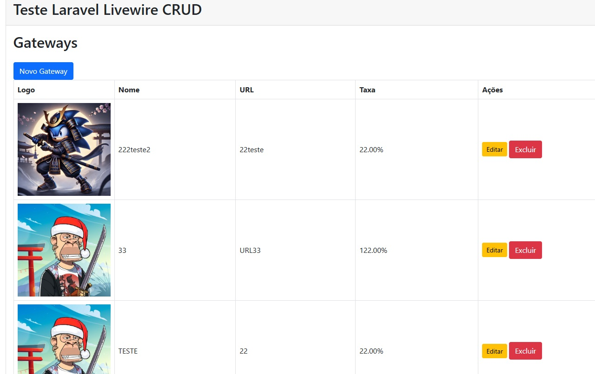
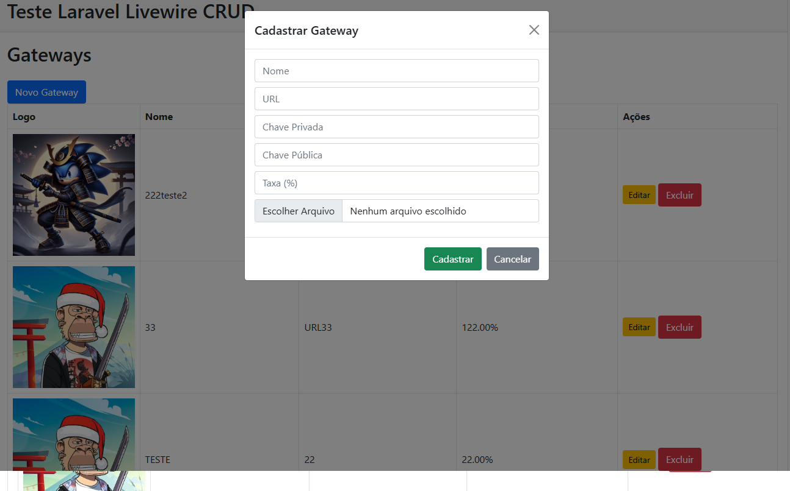

# Teste Laravel Livewire - CRUD de Gateways

Este é um projeto de exemplo utilizando **Laravel 11** com **Livewire** para gerenciar um CRUD de Gateways com upload de logo, validações e formulário em modal Bootstrap.

---

## ✅ Funcionalidades

- Cadastrar gateway com nome, URL, chaves, taxa e logo
- Listagem dinâmica com Livewire
- Edição e exclusão em tempo real
- Interface responsiva com Bootstrap 5
- Upload de imagem com preview no modal

---

## 📦 Requisitos

- PHP >= 8.1
- Composer
- MySQL ou PostgreSQL

---

## ⚙️ Passo a passo para rodar local

### 1. Clone o repositório

```bash
git https://github.com/bragaelmo/TesteLivewire.git
cd TesteLivewire
```

### 2.  Copie o arquivo .env e coloque as configurações do seu banco mysql

```bash
cp .env.example .env
```

### 3.  Instale as dependências PHP

```bash
composer install
```

### 4.  Gere a chave da aplicação e rode as migrations

```bash
php artisan key:generate
php artisan migrate
php artisan storage:link
```

### ▶️ Rodando o projeto
```bash
php artisan serve
```

### Index 


